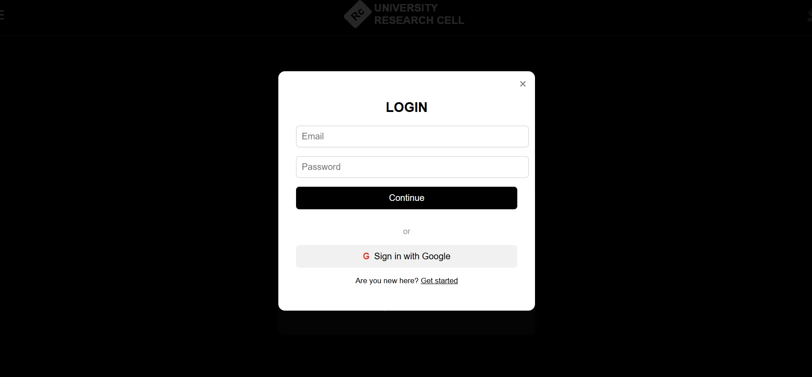

# University Reaserch Cell Management System

This is a full-stack web application designed to manage and streamline the activities of a university research cell. The frontend is built using **React.js**, and the backend will be developed using **Express.js**, **Prisma ORM**, **PostgreSQL**, and **JWT** for authentication.

> This project is submitted in partial fulfillment of the requirements for the **Web Engineering Lab (CSE 616)** course, under the supervision of
> **Rokan Uddin Faruqui**,
> Associate Professor,  
> Department of Computer Science and Engineering, University of Chittagong.

> 🔧 **Backend development is in progress.** 

## 🔧 Tech Stack

### Frontend
- React.js
- CSS (or Tailwind/Bootstrap if applicable)

### Backend (Planned)
- Express.js
- PostgreSQL (Relational Database)
- Prisma ORM (for database queries)
- JWT (JSON Web Token for authentication)

## Current Progress

-  Landing page created (React)
-  Signup/Login modal implemented

## Screenshots

### Landing Page


### Login Modal


### Signup Modal


## Project Structure
Reasearch-Cell/ <br>
├── public <br>
├──src/ <br>
│ ├── App.css <br>
│ ├── App.js <br>
│ ├── landing.css <br>
│ ├── LandingPage.js <br>
│ ├── sign_up.jsx <br>
│ └── signup.css <br>
├── README.md <br>
└── package.json <br>


## 🚀 How to Run (Frontend Only)

1. Clone the repository:
   ```bash
   git clone https://github.com/Fariha-alam-mozumder/Research-Cell.git
   cd Reasearch-Cell

2. Install dependencies:
    ```bash
    npm install
3. Start the development server:
    ```bash 
    npm start


## Team Members

### Group 7
- Mst. Erina Akter – ID: 21701016  
- Humayratul Ekta – ID: 21701030  
- Fariha Alam Mozumder – ID: 21701039  

### Group 20
- Umme Fahmida Trisha – ID: 20701027  
- Toasean Elmah – ID: 20701051  
- Dipannita Das – ID: 21701027  

## License

This project is intended for academic purposes only.
